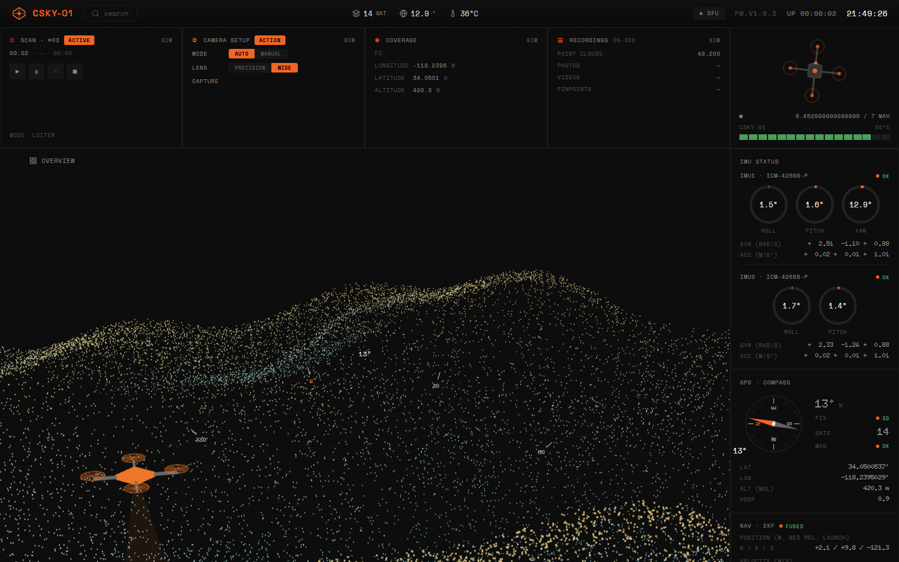
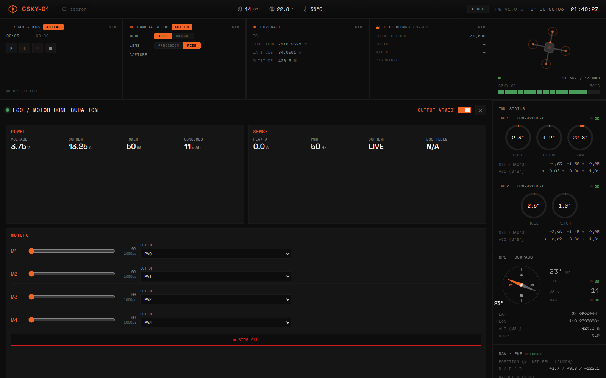
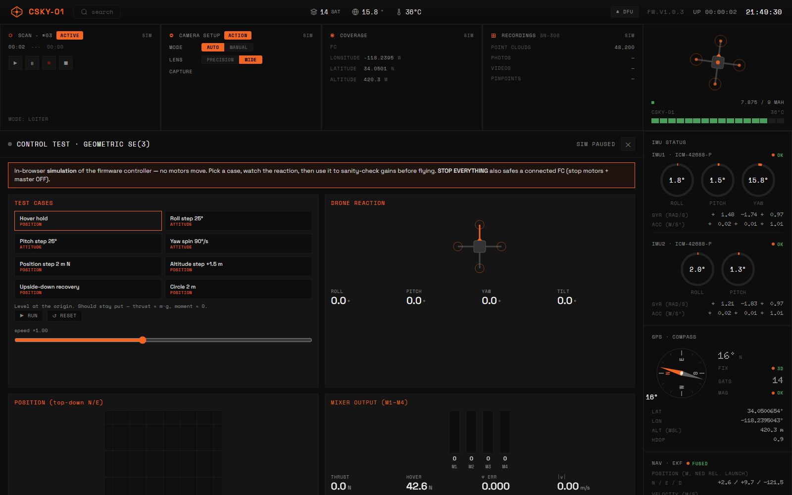
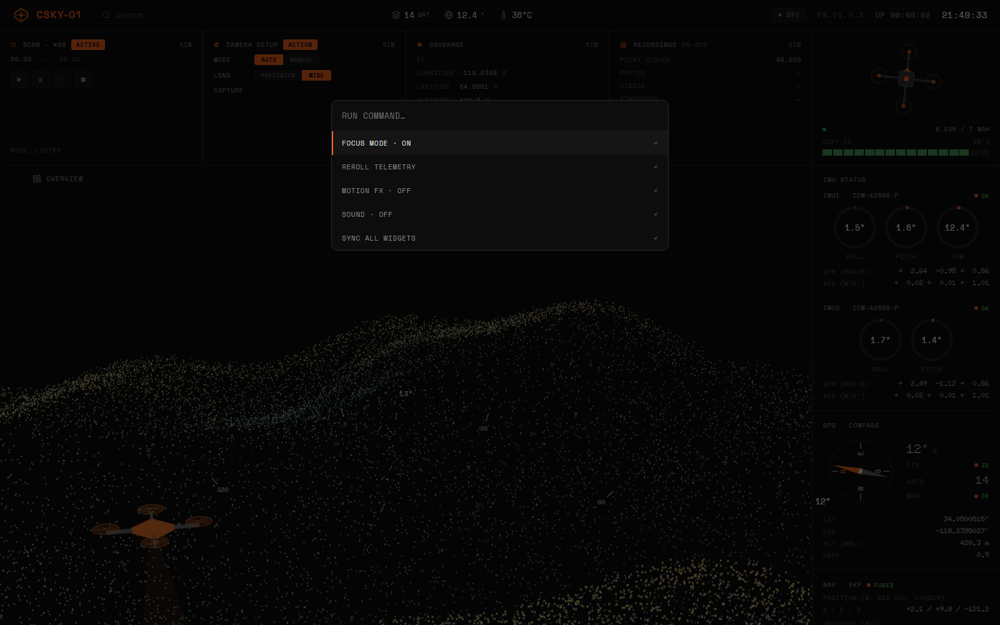
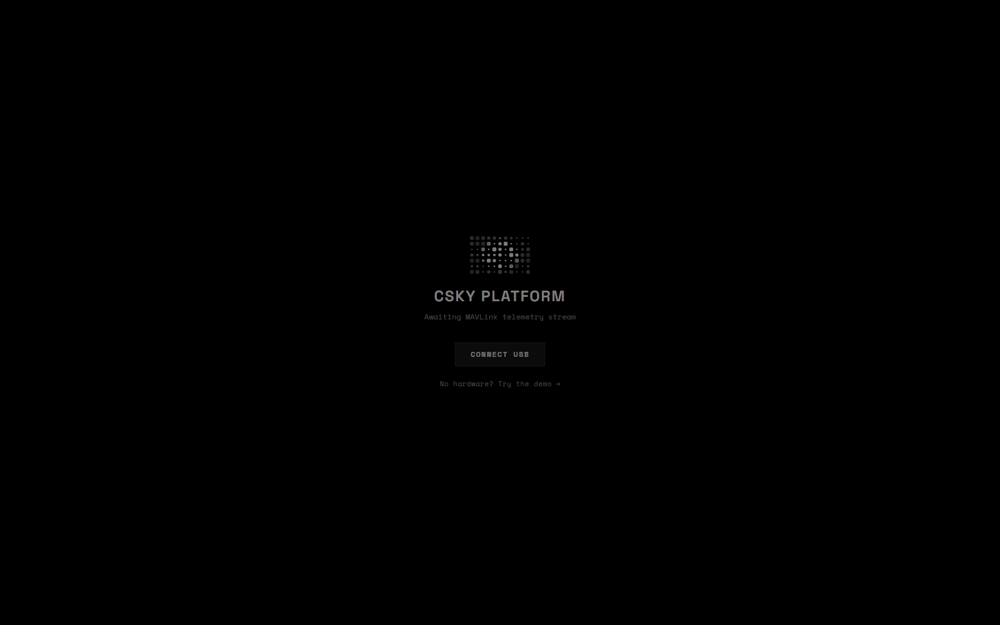
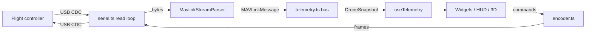

# CSKY Platform

Browser-based ground control station for the CSKY drone. It talks MAVLink 2 directly
to a flight controller over **WebSerial** (USB CDC), decodes telemetry in the browser,
and renders it as a live dashboard with 3D point-cloud and attitude visualisation.

No backend, no agent, no installer. It is a static Vite + React app: open the page,
press connect, pick the serial port, and the flight controller's own MAVLink stream
drives every widget on screen.



**No drone on hand?** Open the app and click *"No hardware? Try the demo"*, or go
straight to `?demo=1` — a simulated MAVLink stream drives the whole UI so you can see
the platform end-to-end without a flight controller. See [Demo mode](#demo-mode).

---

## What this is for

A quadcopter (`CSKY-01`) reports its state over a USB-serial MAVLink 2 link, and this
app is the pilot/operator console for it, entirely inside a browser tab:

- **See** what the aircraft's sensors are reporting right now — IMU, GPS, EKF fusion,
  barometer, optical flow, downward lidar, side proximity, radio link, RC input,
  battery — each on its own live card, no polling delay.
- **Watch** the environment being mapped: a live point-cloud viewport with a 3D drone
  marker and a heading/attitude HUD overlaid on top.
- **Configure** the four analog ESCs — remap logical motors to physical outputs,
  calibrate min/max throttle pulses, spin one motor at a time to verify wiring, or cut
  all four instantly.
- **Sanity-check flight logic before it flies** — the Control Test bench runs the same
  geometric SE(3) controller math as the firmware against a simulated rigid body in
  the browser, so a gain change or a new scenario (upside-down recovery, a step input,
  a circle) can be watched before it's ever tried in the air.
- **Calibrate the battery reading** against a multimeter (Betaflight-style voltage
  multiplier), and **reboot into DFU** to reflash firmware — without touching the
  board.

Everything above is driven by messages this app parses and encodes itself: there is no
MAVLink or serial library doing the work underneath it (see
[Architecture](#architecture)).

---

## Screenshots

| | |
|---|---|
|  **Main dashboard** — point cloud viewport, 3D drone model, IMU/GPS/EKF/baro/proximity/battery cards, attitude HUD, telemetry feed. |  **ESC / motor configuration** — per-motor throttle test, output remap, min/max pulse calibration, live power draw. |
|  **Control test bench** — in-browser SE(3) controller simulation: pick a scenario, watch the reaction, tune mixer gains before flying. |  **Command palette** (`Cmd/Ctrl+K`) — focus mode, motion FX, sound, resync, all from the keyboard. |
|  **Connection overlay** — the screen shown before a flight controller is attached, with a one-click path into demo mode. | |

---

## Demo mode

Every screenshot above (except the connection overlay itself) was taken with **demo
mode**: append `?demo=1` to the URL, or click *"No hardware? Try the demo"* on the
connection screen, and the app skips WebSerial entirely and drives the UI from a
simulated `DroneSnapshot` (`bus.startDemo()` in `src/system/telemetry.ts`) — a plausible
loitering flight with moving IMU/GPS/EKF/battery/ESC values, refreshed a few times a
second. It's the same rendering path real telemetry uses, so every widget behaves as it
would in flight; only the uplink (ESC commands, DFU reboot) is a no-op since there's no
serial port to write to.

Use it to preview the UI, take screenshots, or develop/review widget code without a
flight controller on the desk.

---

## Features

- **Direct MAVLink 2 link** — custom stream parser and frame encoder written for the
  browser. No Node runtime in the data path.
- **Live telemetry dashboard** — IMU, attitude, GPS/compass, EKF/nav, baro, optical
  flow, lidar altitude, proximity, RC link, radio RSSI, battery and ESC telemetry.
- **3D views** — point cloud viewer, animated drone model and navigation HUD via
  `@react-three/fiber` / `drei`.
- **Motor & ESC tooling** — ESC configuration view, per-motor test with throttle and
  timeout, emergency stop-all.
- **Battery calibration** — Betaflight-style `vbatCal` multiplier, fixed or
  auto-detected cell count, rated capacity; used for the state-of-charge estimate.
- **DFU / bootloader reboot** — reboot the FC into its bootloader from the UI.
- **Command palette** — `Cmd/Ctrl + K`.
- **Telemetry log feed** — human-readable decoded message stream, pausable.
- **Demo mode** — `?demo=1` drives every widget from simulated telemetry, no
  flight controller required. See [Demo mode](#demo-mode).

---

## Requirements

- A Chromium-based browser (Chrome, Edge, Brave, Arc). WebSerial is not available in
  Firefox or Safari.
- A secure context: `localhost` or HTTPS.
- [Bun](https://bun.sh) (the repo ships a `bun.lock`). npm/pnpm also work.
- A flight controller that presents a USB CDC serial device and emits MAVLink 2.

## Quick start

```bash
bun install
bun run dev        # http://localhost:5173
```

Build and preview a production bundle:

```bash
bun run build      # tsc --noEmit && vite build  →  dist/
bun run preview
```

`build` type-checks first, so a type error fails the build.

## Connecting

1. Plug the flight controller in over USB.
2. Open the app; the connection overlay (the animated CSKY grid) is shown.
3. Click to connect and select the serial port in the browser prompt.

Under the hood `requestSerialPort()`:

- opens the port at 115200 baud (ignored by CDC, but required by the API),
- asserts **DTR** and **RTS** so the FC knows a terminal is attached,
- starts the read loop and waits up to **5 s** for the first valid MAVLink frame.

If no frame arrives in that window the port is closed and the overlay stays up. That
almost always means the FC is not sending MAVLink 2 on this port, or another program
(a GCS, a serial monitor) already holds the port.

---

## Architecture

```
index.html → src/main.tsx → src/App.tsx
                               │
                               ├── components/ConnectionOverlay   port picker + intro animation
                               ├── components/widgets/*           dashboard cards, HUD, 3D views
                               ├── components/CommandPalette      ⌘K
                               │
                               └── system/
                                   ├── serial.ts      WebSerial port, read loop, writeMavlink()
                                   ├── mavlink/
                                   │   ├── parser.ts          ring-buffer MAVLink 1/2 frame parser
                                   │   ├── encoder.ts         MAVLink 2 frame encoder (uplink)
                                   │   ├── message-registry.ts id → message class
                                   │   ├── messages/*         generated message classes
                                   │   └── enums/*            generated enums
                                   ├── telemetry.ts   the bus: decode → DroneSnapshot + log
                                   ├── hooks.ts       useTelemetry / useTelemetryLog / CtlCtx
                                   ├── geosim.ts      geo helpers & simulated track
                                   └── fake.ts        preview/demo data
```

### Data flow



**Downlink.** `serial.ts` feeds raw chunks into `MavlinkStreamParser`, a ring-buffer
state machine that syncs on `0xFD` (v2) or `0xFE` (v1), accounts for the 13-byte
signature when the incompat flag is set, validates CRC against each message's
`_crc_extra`, and emits typed `MAVLinkMessage` instances.

**State.** `telemetry.ts` folds those messages into a single immutable
`DroneSnapshot` (imu1/imu2, battery, gps, compass, radio, flight, rc, nav, baro,
proximity, ekf, esc, plus fps/frameMs/pointCloudCount). Components subscribe through
`useTelemetry()`; the log feed goes through `logBus` and `useTelemetryLog()`.

**Uplink.** UI actions call bus methods (`escSetConfig`, `escMotorTest`, `escStopAll`,
`escCommand`, `setBatteryConfig`, `rebootToBootloader`). Each builds a message
instance, `encodeMavlink2()` serialises it from the message's own `_message_fields`,
and `writeMavlink()` puts it on the wire. Encoder and parser share the field
definitions, so they cannot drift apart.

### Custom SCKY messages

Vendor messages in the 42xxx dialect range, alongside the standard set:

| ID    | Message           | Direction | Purpose                                              |
|-------|-------------------|-----------|------------------------------------------------------|
| 42010 | `SCKY_ESC_TELEM`  | FC → GCS  | Per-motor RPM, centivolt, centiamp, temperature, errors; aggregate mAh and current |
| 42011 | `SCKY_ESC_CONFIG` | FC → GCS  | Current ESC configuration                            |
| 42012 | `SCKY_ESC_SET`    | GCS → FC  | Apply an ESC configuration patch                     |
| 42013 | `SCKY_ESC_CMD`    | GCS → FC  | Per-ESC command (motor test, stop, etc.)             |
| 42000 | `SCKY_IMU_STATUS` | FC → GCS  | Per-IMU health and `WHO_AM_I`                        |

Adding a message: drop a class in `src/system/mavlink/messages/` with its
`_message_id`, `_crc_extra` and `_message_fields`, then register it in
`message-registry.ts`. Parser and encoder pick it up automatically.

The upstream `mavlink/` directory is the reference MAVLink repository (XML message
definitions and generator) used to produce the TypeScript under `src/system/mavlink/`.
It is not imported at runtime.

---

## Project scripts

| Script            | Does                                             |
|-------------------|--------------------------------------------------|
| `bun run dev`     | Vite dev server with HMR                         |
| `bun run build`   | Type-check, then build to `dist/`                |
| `bun run preview` | Serve the built `dist/`                          |

## Stack

React 19 · TypeScript · Vite · three.js with `@react-three/fiber` and `drei` ·
`motion` for animation · WebSerial · `vite-plugin-node-polyfills` (Buffer/events for
the MAVLink shim).

## Troubleshooting

| Symptom | Likely cause |
|---|---|
| No connect prompt | Not Chromium, or page is not on `localhost`/HTTPS |
| Port opens then disconnects after 5 s | No MAVLink 2 frames received: wrong port, FC not streaming, or baud/protocol mismatch |
| "Failed to open serial port" | Another application holds the port; close your other GCS or serial monitor |
| Telemetry frozen | FC rebooted or cable dropped: reload the page and reconnect |
| Battery percentage looks wrong | Set cell count and `vbatCal` in the battery card |
| Want to check the UI without hardware | Use `?demo=1` (see [Demo mode](#demo-mode)) |

## Safety

Motor test and ESC commands spin real propellers. **Remove props before using the ESC
or control test views.** Motor tests take a timeout (default 2 s) and `escStopAll()`
is always available, but neither replaces physically removing the props.
